<div align="center">



<br>


</div>

I build secure, scalable applications where the threat model is written before the first line of code.

**Zero-Trust is the default, not a feature.** No implicit trust between services, users, or networks — every request authenticated, every boundary verified, every blast radius contained. Former military cyber operations; that background shapes the discipline, not the marketing.

- Zero-Trust architecture, end to end — identity-bound, least privilege, assume breach
- Cryptographic resilience — modern primitives, hardware-backed keys, post-quantum migration paths
- Anonymity and metadata hygiene as engineering requirements, not afterthoughts


## Expertise

<details open>
<summary><b>Languages</b></summary>


</details>

<details open>
<summary><b>Frontend &amp; Runtime</b></summary>


</details>

<details open>
<summary><b>Data</b></summary>


</details>

<details open>
<summary><b>Infrastructure &amp; DevOps</b></summary>


</details>

<details open>
<summary><b>Security &amp; Privacy</b></summary>


</details>

<details open>
<summary><b>AI/ML &amp; Tooling</b></summary>


</details>


## Why OPSEC

In a world of pervasive surveillance, operational security isn't optional — it's essential.
Whether you're defending against nation-state actors or protecting user data, **discipline is not a choice.**

```console
$ threat-model --assume-breach --minimise-blast-radius
[✓] no implicit trust, anywhere
[✓] keys in hardware, never on disk
[✓] metadata is data
[✓] the quietest system wins
```

<div align="center">

<sub>No contact details by design. If we need to talk, you already know how.</sub>
</div>
